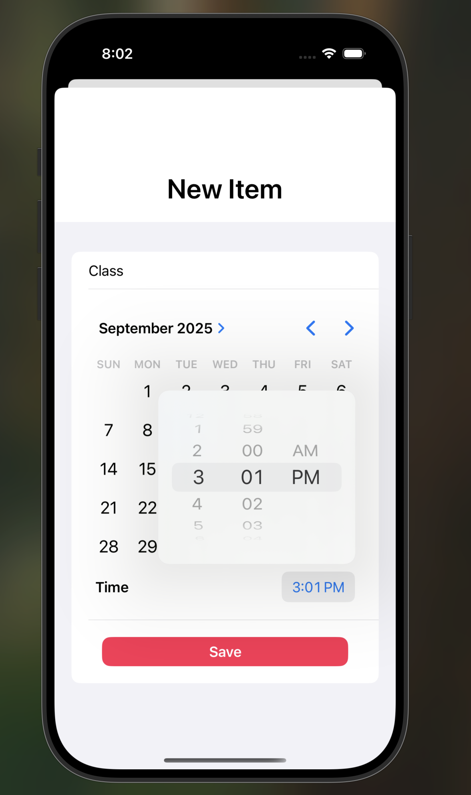
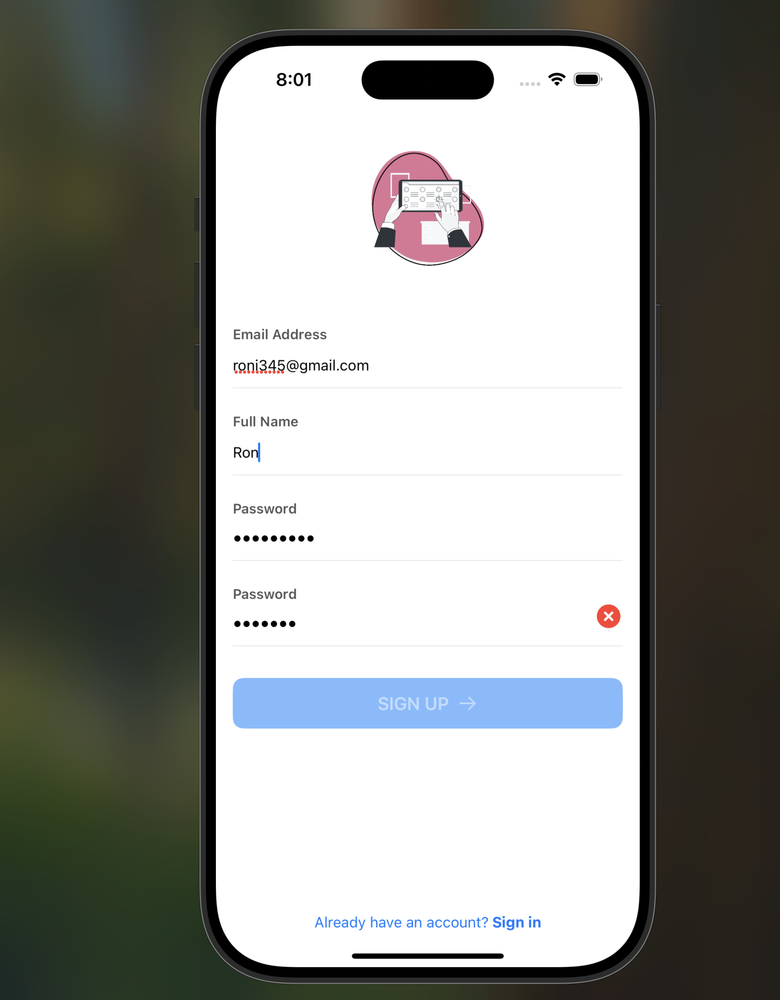
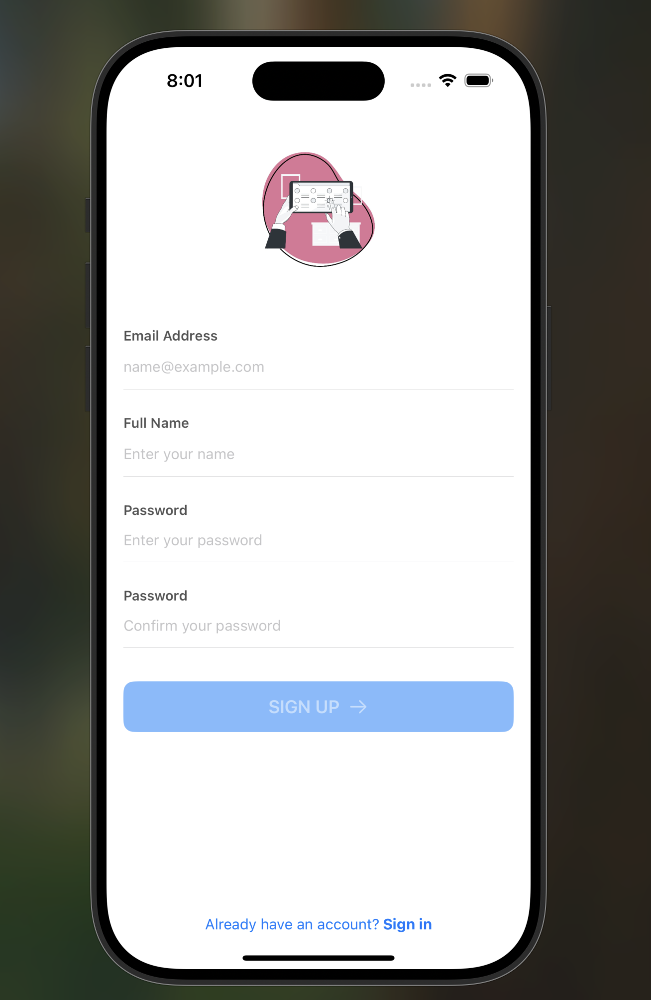
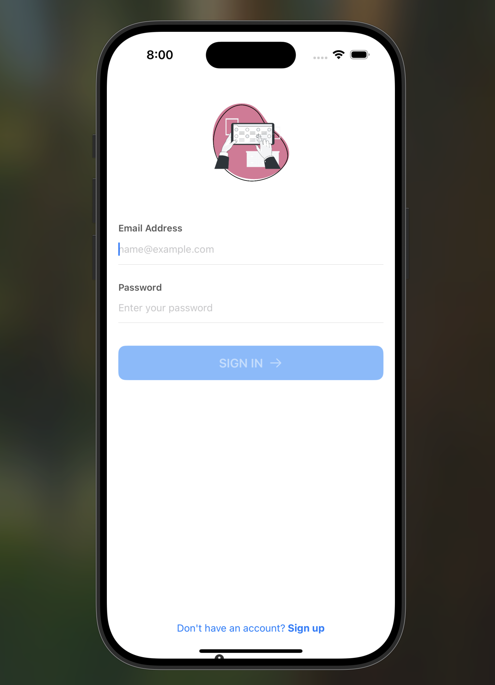

# 📝 To Do List App

SwiftUI iOS to-do list powered by **Firebase Authentication**, **Cloud Firestore**, and **Google Cloud Platform**.

---

## 📱 Demo

### New Task


### Empty List


### Sign Up (Prefilled)


### Sign Up (Empty)


### Sign In


---

## 🚀 Installation & Usage

### 1. Clone the repository
```bash
git clone https://github.com/yourusername/todo-list-app.git
2. Configure Firebase
Add your GoogleService-Info.plist (from Firebase) to the project root.

3. Open in Xcode
Use ToDoListApp.xcworkspace (CocoaPods) or

ToDoListApp.xcodeproj (Swift Package Manager).

4. Build & Run
Select a simulator or a connected device.

Press Run (⌘R).

5. Get started
Sign Up / Sign In with email & password.

Tap + to create a task, select date & time, then tap Save.

View and manage your tasks in the Home tab.

🛠 Features
Task Management: Create, view, and delete to-do items.

Date & Time Picker: Schedule tasks with custom reminders.

User Authentication: Firebase Email/Password sign up & sign in.

Real-Time Sync: Tasks stored in Cloud Firestore with live updates.

Profile Tab: Manage user profile and sign out.

💻 Technologies
SwiftUI

Firebase Authentication

Cloud Firestore

Google Cloud Platform

Xcode 14+, iOS 15+

🤝 Contributing
Contributions are welcome!
Fork the repo and submit a pull request.

📄 License
MIT License. See LICENSE for details.

Built by Ron
